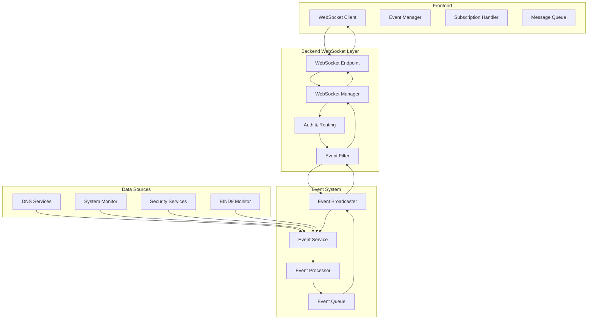

# WebSocket System Optimization Design

## Overview

This design document outlines the architecture for optimizing the hybrid DNS server's WebSocket system to use a single, unified connection per user while maintaining all existing functionality and adding enhanced features. The new system will provide better resource utilization, improved scalability, and enhanced real-time communication capabilities.

## Architecture

### High-Level Architecture



### Core Components

#### 1. Unified WebSocket Manager
- **Single Connection Per User**: Maintains one WebSocket connection per authenticated user
- **Dynamic Subscription Management**: Handles event type subscriptions/unsubscriptions
- **Permission-Based Filtering**: Filters events based on user roles and permissions
- **Connection Health Monitoring**: Implements heartbeat and automatic recovery

#### 2. Event Broadcasting System
- **Centralized Event Hub**: Single point for all event generation and distribution
- **Event Routing**: Intelligent routing based on subscriptions and permissions
- **Message Batching**: Optimizes network usage by batching related events
- **Priority Queuing**: Handles critical events with higher priority

#### 3. Enhanced Authentication & Authorization
- **JWT Token Validation**: Secure token-based authentication for WebSocket connections
- **Role-Based Access Control**: Granular permissions for different event types
- **Session Management**: Handles token refresh and session expiration
- **Security Auditing**: Logs all WebSocket authentication and authorization events

## Components and Interfaces

### Backend Components

#### WebSocket Manager (Enhanced)
```python
class UnifiedWebSocketManager:
    """Unified WebSocket manager with single connection per user"""
    
    def __init__(self):
        self.connections: Dict[str, WebSocketConnection] = {}
        self.event_subscriptions: Dict[str, Set[EventType]] = {}
        self.user_permissions: Dict[str, UserPermissions] = {}
        self.message_queue: asyncio.Queue = asyncio.Queue()
        self.event_filters: List[EventFilter] = []
    
    async def connect_user(self, websocket: WebSocket, user: WSUser) -> bool
    async def disconnect_user(self, user_id: str) -> None
    async def subscribe_to_events(self, user_id: str, event_types: List[EventType]) -> None
    async def unsubscribe_from_events(self, user_id: str, event_types: List[EventType]) -> None
    async def broadcast_event(self, event: Event) -> None
    async def send_to_user(self, user_id: str, message: Dict[str, Any]) -> None
```

#### Event Broadcasting Service
```python
class EventBroadcastingService:
    """Centralized event broadcasting with filtering and routing"""
    
    def __init__(self, websocket_manager: UnifiedWebSocketManager):
        self.websocket_manager = websocket_manager
        self.event_processors: Dict[EventType, EventProcessor] = {}
        self.event_queue: asyncio.Queue = asyncio.Queue()
    
    async def emit_event(self, event_type: EventType, data: Dict[str, Any], 
                        source_user_id: Optional[str] = None) -> None
    async def process_event_queue(self) -> None
    async def register_event_processor(self, event_type: EventType, 
                                     processor: EventProcessor) -> None
```

#### Event Filter System
```python
class EventFilter:
    """Base class for event filtering"""
    
    async def should_send_to_user(self, event: Event, user: WSUser) -> bool
    async def filter_event_data(self, event: Event, user: WSUser) -> Dict[str, Any]

class PermissionEventFilter(EventFilter):
    """Filters events based on user permissions"""
    
class DataSensitivityFilter(EventFilter):
    """Filters sensitive data from events"""
    
class RateLimitFilter(EventFilter):
    """Implements rate limiting for events"""
```

### Frontend Components

#### Unified WebSocket Service
```typescript
class UnifiedWebSocketService {
    private ws: WebSocket | null = null
    private subscriptions: Set<EventType> = new Set()
    private eventHandlers: Map<EventType, Set<EventHandler>> = new Map()
    private messageQueue: WebSocketMessage[] = []
    private reconnectStrategy: ReconnectStrategy
    
    async connect(token: string): Promise<void>
    async disconnect(): Promise<void>
    async subscribe(eventTypes: EventType[]): Promise<void>
    async unsubscribe(eventTypes: EventType[]): Promise<void>
    on(eventType: EventType, handler: EventHandler): void
    off(eventType: EventType, handler: EventHandler): void
    send(message: WebSocketMessage): Promise<boolean>
}
```

#### Event Manager
```typescript
class EventManager {
    private websocketService: UnifiedWebSocketService
    private eventBuffer: Map<EventType, Event[]> = new Map()
    private processingQueue: Event[] = []
    
    async initialize(token: string): Promise<void>
    async subscribeToEvents(eventTypes: EventType[]): Promise<void>
    async handleEvent(event: Event): Promise<void>
    async batchProcessEvents(): Promise<void>
}
```

## Data Models

### Event Model
```python
@dataclass
class Event:
    id: str
    type: EventType
    data: Dict[str, Any]
    timestamp: datetime
    source_user_id: Optional[str]
    priority: EventPriority
    metadata: Dict[str, Any]
    
    def to_websocket_message(self) -> Dict[str, Any]:
        return {
            "id": self.id,
            "type": self.type.value,
            "data": self.data,
            "timestamp": self.timestamp.isoformat(),
            "priority": self.priority.value,
            "metadata": self.metadata
        }
```

### WebSocket Connection Model
```python
@dataclass
class WebSocketConnection:
    websocket: WebSocket
    user: WSUser
    connected_at: datetime
    last_ping: datetime
    subscriptions: Set[EventType]
    message_count: int
    is_healthy: bool
    
    async def send_message(self, message: Dict[str, Any]) -> bool
    async def ping(self) -> bool
    def is_subscribed_to(self, event_type: EventType) -> bool
```

### User Permissions Model
```python
@dataclass
class UserPermissions:
    user_id: str
    is_admin: bool
    allowed_event_types: Set[EventType]
    data_access_level: DataAccessLevel
    rate_limits: Dict[EventType, int]
    
    def can_access_event(self, event_type: EventType) -> bool
    def get_rate_limit(self, event_type: EventType) -> int
```

## Error Handling

### Connection Error Handling
- **Authentication Failures**: Clear error messages and redirect to login
- **Permission Denied**: Graceful degradation with limited functionality
- **Network Issues**: Automatic reconnection with exponential backoff
- **Server Overload**: Queue management and connection throttling

### Event Processing Error Handling
- **Event Serialization Errors**: Fallback to basic event format
- **Filter Processing Errors**: Skip problematic filters and log errors
- **Broadcasting Errors**: Retry mechanism with dead letter queue
- **Rate Limiting**: Graceful throttling with user notification

### Recovery Mechanisms
```python
class ErrorRecoveryManager:
    async def handle_connection_error(self, user_id: str, error: Exception) -> None
    async def handle_event_processing_error(self, event: Event, error: Exception) -> None
    async def handle_authentication_error(self, websocket: WebSocket, error: Exception) -> None
    async def recover_failed_connection(self, user_id: str) -> bool
```

## Testing Strategy

### Unit Testing
- **WebSocket Manager**: Test connection management, subscription handling
- **Event Filters**: Test permission filtering, data sanitization
- **Event Broadcasting**: Test event routing, message batching
- **Authentication**: Test JWT validation, permission checking

### Integration Testing
- **End-to-End Event Flow**: Test complete event lifecycle from generation to delivery
- **Multi-User Scenarios**: Test concurrent users with different permissions
- **Network Failure Scenarios**: Test reconnection and recovery mechanisms
- **Performance Testing**: Test with high event volumes and many concurrent users

### Load Testing
```python
class WebSocketLoadTest:
    async def test_concurrent_connections(self, user_count: int) -> TestResults
    async def test_high_event_volume(self, events_per_second: int) -> TestResults
    async def test_subscription_changes(self, change_rate: int) -> TestResults
    async def test_memory_usage(self, duration: timedelta) -> TestResults
```

## Performance Optimizations

### Message Batching
- **Event Aggregation**: Combine related events into single messages
- **Time-Based Batching**: Send batched messages at regular intervals
- **Size-Based Batching**: Send when batch reaches optimal size
- **Priority Override**: Send critical events immediately

### Memory Management
- **Connection Pooling**: Reuse connection objects
- **Event Buffer Limits**: Prevent memory leaks from unbounded queues
- **Garbage Collection**: Regular cleanup of expired events and connections
- **Resource Monitoring**: Track memory usage and connection counts

### Network Optimization
```python
class NetworkOptimizer:
    def __init__(self):
        self.compression_enabled = True
        self.batch_size = 10
        self.batch_timeout = 1.0  # seconds
    
    async def optimize_message(self, message: Dict[str, Any]) -> bytes
    async def batch_messages(self, messages: List[Dict[str, Any]]) -> bytes
    async def compress_data(self, data: bytes) -> bytes
```

## Security Considerations

### Authentication Security
- **JWT Token Validation**: Verify token signature and expiration
- **Token Refresh**: Handle token refresh without disconnection
- **Session Management**: Track active sessions and handle expiration
- **Brute Force Protection**: Rate limit connection attempts

### Data Security
- **Permission-Based Filtering**: Ensure users only see authorized data
- **Data Sanitization**: Remove sensitive information from events
- **Audit Logging**: Log all WebSocket activities for security monitoring
- **Encryption**: Use WSS (WebSocket Secure) for all connections

### Rate Limiting and DoS Protection
```python
class SecurityManager:
    def __init__(self):
        self.rate_limiters: Dict[str, RateLimiter] = {}
        self.connection_limits: Dict[str, int] = {}
    
    async def check_rate_limit(self, user_id: str, event_type: EventType) -> bool
    async def check_connection_limit(self, user_id: str) -> bool
    async def log_security_event(self, event_type: str, details: Dict[str, Any]) -> None
```

## Migration Strategy

### Phase 1: Parallel Implementation
- Implement new unified WebSocket system alongside existing system
- Add feature flags to switch between old and new systems
- Gradual rollout to test users

### Phase 2: Frontend Migration
- Update frontend components to use unified WebSocket service
- Maintain backward compatibility with existing event handlers
- Provide migration utilities for existing code

### Phase 3: Backend Consolidation
- Remove old WebSocket endpoints and managers
- Consolidate event broadcasting logic
- Update all services to use new event system

### Phase 4: Optimization and Cleanup
- Remove deprecated code and feature flags
- Optimize performance based on production usage
- Update documentation and examples

## Monitoring and Observability

### Metrics Collection
```python
class WebSocketMetrics:
    def __init__(self):
        self.connection_count = 0
        self.message_throughput = 0
        self.event_processing_time = {}
        self.error_rates = {}
    
    async def record_connection(self, user_id: str) -> None
    async def record_message(self, event_type: EventType, processing_time: float) -> None
    async def record_error(self, error_type: str) -> None
    async def get_metrics_summary(self) -> Dict[str, Any]
```

### Health Checks
- **Connection Health**: Monitor WebSocket connection status
- **Event Processing Health**: Track event queue sizes and processing times
- **Memory Health**: Monitor memory usage and detect leaks
- **Performance Health**: Track response times and throughput

### Alerting
- **High Error Rates**: Alert when error rates exceed thresholds
- **Connection Failures**: Alert on authentication or connection issues
- **Performance Degradation**: Alert when response times increase
- **Resource Exhaustion**: Alert when memory or connection limits approached